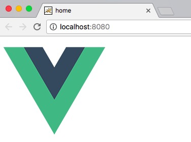
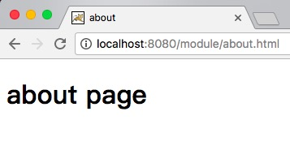

## 简介

基于vue-cli脚手架pc端的`多页面`开发，和之前的一个公司的项目进行比较[webpack](https://github.com/reng99/webpack),探讨使用哪种技术进行前端开发。正在完善搭建中，如果你喜欢，star🌟支持下了。如有不妥地方，还请指出，共勉啊！

## 项目地址

[vue-cli_multipage](https://github.com/reng99/vue-cli_multipage)


## 使用方法

```javascript

  # 下载代码
  $ git clone https://github.com/reng99/webpack.git

  # 安装依赖
  $ npm install

  # 开发模式
  $ npm run dev
  [首页 localhost:8080 | localhost:8080/index.html]
  [关于页面 localhost:8080/module/about.html]

  # 生产模式
  $ npm run build

```
以后添加的目录，在module下参照`about`页面进行添加。


## 初步搭建感受

vue-cli适合spa项目，在用到mpa项目的时候感觉很多的不适，比如对资源的管理。希望自己在后期的学习中，能够发现一些问题。也希望有感兴趣的人儿能够参与其中，新建issue，然后一起来解决issue。本仓库可以给尝试搭建vue多页面的人儿踢狗些参考。喜欢的话，记得star🌟下哦。

## 项目布局

```javascript
    .
    ├── build                                       // webpack配置文件
    ├── config                                      // 项目打包路径
    ├── node_modules                                // 项目的依赖（执行 npm install 后产生）
    ├── dist                                        // 上线项目文件，放在服务器即可正常访问（执行 npm run build 后产生）
    ├── src                                         // 源码目录
    ├── static                                      // 存放静态资源的地方，在build之后会生成dist文件夹，这个文件夹中的文件会原封不动放进去
    ├── .babelrc                                    // webpack插件babel的设置
    ├── .editorconfig                               // 编辑器生成的配置文件，在各个项目中可以自由配置
    ├── .eslintignore                               // 使用eslint检测代码是否符合规则的忽略目录，用于eslint设置
    ├── .eslintrc                                   // eslint设置
    ├── .gitignore                                  // 使用Git版本管理时需要忽略的目录，用于Git设置
    ├── .postcssrc.js                               // （不知）
    ├── .package.json                               // nodejs的配置
    ├── README.md                                   // 说明文件，项目的说明
    .


```

## 基本搭建步骤（初期搭建，由于版本的叠加，现在的项目已经不是初期建立的样子）

**1.执行vue init webpack your_project_name**

这里选择安装如下：

```javascript

  .
  ├── ? Project name (your_project_name)
  ├── ? Project description (A Vue.js project)
  ├── ? Author (your name)
  ├── ? Vue build standalone
  ├── ? Vue build standalone
  ├── ? Install vue-router? Yes
  ├── ? Use ESLint to lint your code? Yes
  ├── ? Pick an ESLint preset Standard
  ├── ? Setup unit tests with Karma + Mocha? No
  ├── ? Setup e2e tests with Nightwatch? No

  vue-cli Generated "your_project_name".

  To get started:

    cd your_project_name
    npm install
    npm run dev

  ...

```

**2.调整项目**

去掉根目录的`index.html`,调整`src`的目录如下：

```

  .
  ├── assets
  │       └── logo.png
  ├── components
  │       ├── About.vue
  │       └── Home.vue
  ├── module
  │       ├── about
  │       │     ├── about.html
  │       │     ├── about.js
  │       │
  │       ├── index.html
  │       └── index.js
  │
  │
  ├── router
  .

```

各个文件的内容如下：

components --> About.vue

```javascript

  <template>
    <div id="about">
      <h1>about page</h1>
    </div>
  </template>

  <script>
    export default {
      name:"about"
    }
  </script>

  <style scoped>

  </style>

```

components --> Home.vue

```javascript

  <template>
    <div id="home">
      
    </div>
  </template>

  <script>
    export default {
      name: 'home'
    }
  </script>

  <style>

  </style>

```

module --> index.html

```html

  <!DOCTYPE html>
  <html>
    <head>
      <meta charset="utf-8">
      <title>home</title>
    </head>
    <body>
      <div id="app"></div>

      <!-- built files will be auto injected -->
    </body>
  </html>

```

module --> index.js

```javascript

// The Vue build version to load with the `import` command
// (runtime-only or standalone) has been set in webpack.base.conf with an alias.
import Vue from 'vue'
import Home from '@/components/Home'

Vue.config.productionTip = false

/* eslint-disable no-new */
new Vue({
  // router,
  render: h => h(Home)
}).$mount('#app')

```


module --> about --> about.html

```html

  <!DOCTYPE html>
  <html>
    <head>
      <meta charset="utf-8">
      <title>about</title>
    </head>
    <body>
      <div id="about"></div>
      <!-- built files will be auto injected -->
    </body>
  </html>

```

module --> about --> about.js

```javascript

  import Vue from 'vue'
  import About from '@/components/About'

  Vue.config.productionTip = false

  new Vue({
    render: h => h(About)
  }).$mount('#about')

```

**3.修改配置**

修改 build --> webpack.base.conf.js

```javascript

  var path = require('path')
  var utils = require('./utils')
  var config = require('../config')
  var vueLoaderConfig = require('./vue-loader.conf')

  function resolve (dir) {
    return path.join(__dirname, '..', dir)
  }

  // 新增
  var glob = require("glob");
  var entries = getEntry(['./src/module/*.js','./src/module/**/*.js']); // 获得入口js文件

  module.exports = {
    entry: entries,
    output: {
      path: config.build.assetsRoot,
      filename: '[name].js',
      publicPath: process.env.NODE_ENV === 'production'
        ? config.build.assetsPublicPath
        : config.dev.assetsPublicPath
    },
    resolve: {
      extensions: ['.js', '.vue', '.json'],
      alias: {
        'vue$': 'vue/dist/vue.esm.js',
        '@': resolve('src')
      }
    },
    module: {
      rules: [
        {
          test: /\.(js|vue)$/,
          loader: 'eslint-loader',
          enforce: 'pre',
          include: [resolve('src'), resolve('test')],
          options: {
            formatter: require('eslint-friendly-formatter')
          }
        },
        {
          test: /\.vue$/,
          loader: 'vue-loader',
          options: vueLoaderConfig
        },
        {
          test: /\.js$/,
          loader: 'babel-loader',
          include: [resolve('src'), resolve('test')]
        },
        {
          test: /\.(png|jpe?g|gif|svg)(\?.*)?$/,
          loader: 'url-loader',
          options: {
            limit: 10000,
            name: utils.assetsPath('img/[name].[hash:7].[ext]')
          }
        },
        {
          test: /\.(mp4|webm|ogg|mp3|wav|flac|aac)(\?.*)?$/,
          loader: 'url-loader',
          options: {
            limit: 10000,
            name: utils.assetsPath('media/[name].[hash:7].[ext]')
          }
        },
        {
          test: /\.(woff2?|eot|ttf|otf)(\?.*)?$/,
          loader: 'url-loader',
          options: {
            limit: 10000,
            name: utils.assetsPath('fonts/[name].[hash:7].[ext]')
          }
        }
      ]
    }
  }

  function getEntry(globPath) {
    var entries = {},
      basename,tmp,pathname;
    if(typeof (globPath) != "object") {
      globPath = [globPath];  // 转化成数组对象
    }
    // 遍历每个路径
    globPath.forEach((itemPath) => {//itemPath是匹配的规则'./src/module/*.js','./src/module/**/*.js'
      glob.sync(itemPath).forEach(function(entry){//entry是匹配到的文件如：'./src/module/index.js'
        basename = path.basename(entry,path.extname(entry));//取得文件名，不带后缀，如index,而不是index.js
        if(entry.split('/').length>4){
          tmp = entry.split('/').splice(-3);
          pathname = tmp.splice(0,1)+'/'+basename;//正确输出js和html的路径
          entries[pathname] = entry;
        }else{
          entries[basename] = entry;
        }
      });
    });
    return entries;
  }

```

修改build --> webpack.dev.conf.js

```javascript

  var utils = require('./utils')
  var webpack = require('webpack')
  var config = require('../config')
  var merge = require('webpack-merge')
  var baseWebpackConfig = require('./webpack.base.conf')
  var HtmlWebpackPlugin = require('html-webpack-plugin')
  var FriendlyErrorsPlugin = require('friendly-errors-webpack-plugin')


  //增加内容
  var path = require("path");
  var glob = require("glob");

  // add hot-reload related code to entry chunks
  Object.keys(baseWebpackConfig.entry).forEach(function (name) {
    baseWebpackConfig.entry[name] = ['./build/dev-client'].concat(baseWebpackConfig.entry[name])
  })

  module.exports = merge(baseWebpackConfig, {
    module: {
      rules: utils.styleLoaders({ sourceMap: config.dev.cssSourceMap })
    },
    // cheap-module-eval-source-map is faster for development
    devtool: '#cheap-module-eval-source-map',
    plugins: [
      new webpack.DefinePlugin({
        'process.env': config.dev.env
      }),
      // https://github.com/glenjamin/webpack-hot-middleware#installation--usage
      new webpack.HotModuleReplacementPlugin(),
      new webpack.NoEmitOnErrorsPlugin(),
      // https://github.com/ampedandwired/html-webpack-plugin
      // new HtmlWebpackPlugin({
      //   filename: 'index.html',
      //   template: 'index.html',
      //   inject: true
      // }),
      new FriendlyErrorsPlugin()
    ]
  })

  //增加内容，获得.html输出的对象
  function getEntry(globPath) {
    var entries = {},
      basename,tmp,pathname;
    if(typeof (globPath) != "object") {
      globPath = [globPath];  // 转化成数组对象
    }
    // 遍历每个路径
    globPath.forEach((itemPath) => {//itemPath是匹配的规则'./src/module/*.js','./src/module/**/*.js'
      glob.sync(itemPath).forEach(function(entry){//entry是匹配到的文件如：'./src/module/index.js'
        basename = path.basename(entry,path.extname(entry));//取得文件名，不带后缀，如index,而不是index.js
        if(entry.split('/').length>4){
          tmp = entry.split('/').splice(-3);
          pathname = tmp.splice(0,1)+'/'+basename;//正确输出js和html的路径
          entries[pathname] = entry;
        }else{
          entries[basename] = entry;
        }
      });
    });
    return entries;
  }

  //模版文件
  var pages = getEntry(['./src/module/*.html','./src/module/**/*.html']);

  //console.log(pages);

  for (var pathname in pages) {
    // 配置生成的html文件，定义路径等
    var conf = {
      filename: pathname + '.html',
      template: pages[pathname],   // 模板路径
      inject: true,              // js插入位置
      // necessary to consistently work with multiple chunks via CommonsChunkPlugin
      chunksSortMode: 'dependency'

    };

    if (pathname in module.exports.entry) {
      conf.chunks = ['manifest', 'vendor', pathname];
      conf.hash = true;
    }

    module.exports.plugins.push(new HtmlWebpackPlugin(conf));
  }


```

修改build --> webpack.prod.conf.js

```javascript

  var path = require('path')
  var utils = require('./utils')
  var webpack = require('webpack')
  var config = require('../config')
  var merge = require('webpack-merge')
  var baseWebpackConfig = require('./webpack.base.conf')
  var CopyWebpackPlugin = require('copy-webpack-plugin')
  var HtmlWebpackPlugin = require('html-webpack-plugin')
  var ExtractTextPlugin = require('extract-text-webpack-plugin')
  var OptimizeCSSPlugin = require('optimize-css-assets-webpack-plugin')

  var env = config.build.env

  //增加内容
  var glob = require('glob');

  var webpackConfig = merge(baseWebpackConfig, {
    module: {
      rules: utils.styleLoaders({
        sourceMap: config.build.productionSourceMap,
        extract: true
      })
    },
    devtool: config.build.productionSourceMap ? '#source-map' : false,
    output: {
      path: config.build.assetsRoot,
      filename: utils.assetsPath('js/[name].[chunkhash].js'),
      chunkFilename: utils.assetsPath('js/[id].[chunkhash].js')
    },
    plugins: [
      // http://vuejs.github.io/vue-loader/en/workflow/production.html
      new webpack.DefinePlugin({
        'process.env': env
      }),
      new webpack.optimize.UglifyJsPlugin({
        compress: {
          warnings: false
        },
        sourceMap: true
      }),
      // extract css into its own file
      new ExtractTextPlugin({
        filename: utils.assetsPath('css/[name].[contenthash].css')
      }),
      // Compress extracted CSS. We are using this plugin so that possible
      // duplicated CSS from different components can be deduped.
      new OptimizeCSSPlugin({
        cssProcessorOptions: {
          safe: true
        }
      }),
      // split vendor js into its own file
      new webpack.optimize.CommonsChunkPlugin({
        name: 'vendor',
        minChunks: function (module, count) {
          // any required modules inside node_modules are extracted to vendor
          return (
            module.resource &&
            /\.js$/.test(module.resource) &&
            module.resource.indexOf(
              path.join(__dirname, '../node_modules')
            ) === 0
          )
        }
      }),
      // extract webpack runtime and module manifest to its own file in order to
      // prevent vendor hash from being updated whenever app bundle is updated
      new webpack.optimize.CommonsChunkPlugin({
        name: 'manifest',
        chunks: ['vendor']
      }),
      // copy custom static assets
      new CopyWebpackPlugin([
        {
          from: path.resolve(__dirname, '../static'),
          to: config.build.assetsSubDirectory,
          ignore: ['.*']
        }
      ])
    ]
  })

  if (config.build.productionGzip) {
    var CompressionWebpackPlugin = require('compression-webpack-plugin')

    webpackConfig.plugins.push(
      new CompressionWebpackPlugin({
        asset: '[path].gz[query]',
        algorithm: 'gzip',
        test: new RegExp(
          '\\.(' +
          config.build.productionGzipExtensions.join('|') +
          ')$'
        ),
        threshold: 10240,
        minRatio: 0.8
      })
    )
  }

  if (config.build.bundleAnalyzerReport) {
    var BundleAnalyzerPlugin = require('webpack-bundle-analyzer').BundleAnalyzerPlugin
    webpackConfig.plugins.push(new BundleAnalyzerPlugin())
  }

  module.exports = webpackConfig

  //增加内容，获得.html输出的对象
  function getEntry(globPath) {
    var entries = {},
      basename,tmp,pathname;
    if(typeof (globPath) != "object") {
      globPath = [globPath];  // 转化成数组对象
    }
    // 遍历每个路径
    globPath.forEach((itemPath) => {//itemPath是匹配的规则'./src/module/*.js','./src/module/**/*.js'
      glob.sync(itemPath).forEach(function(entry){//entry是匹配到的文件如：'./src/module/index.js'
        basename = path.basename(entry,path.extname(entry));//取得文件名，不带后缀，如index,而不是index.js
        if(entry.split('/').length>4){
          tmp = entry.split('/').splice(-3);
          pathname = tmp.splice(0,1)+'/'+basename;//正确输出js和html的路径
          entries[pathname] = entry;
        }else{
          entries[basename] = entry;
        }
      });
    });
    return entries;
  }

  //模版文件
  var pages = getEntry(['./src/module/*.html','./src/module/**/*.html']);

  //console.log(pages);

  for (var pathname in pages) {
    // 配置生成的html文件，定义路径等
    var conf = {
      filename: pathname + '.html',
      template: pages[pathname],   // 模板路径
      inject: true,              // js插入位置
      // necessary to consistently work with multiple chunks via CommonsChunkPlugin
      chunksSortMode: 'dependency'

    };

    if (pathname in module.exports.entry) {
      conf.chunks = ['manifest', 'vendor', pathname];
      conf.hash = true;
    }

    module.exports.plugins.push(new HtmlWebpackPlugin(conf));
  }

```

**4.查看效果**

安装相关的依赖，`npm install`

执行`npm run dev`运行

在浏览器中查看`localhost:8080 || localhost:8080/index.html`首页



在浏览器中查看`localhost:8080/module/about.html`关于页面




## 参考

- [glob](https://www.npmjs.com/package/glob)

- [glob.sync](https://www.npmjs.com/package/glob#globsyncpattern-options)


## 说明

- 本项目的图片来源是自己在谷歌上运行的截图

- 本项目用vue搭建多页应用存在路由等问题，因为自己的实力问题，未能解决
